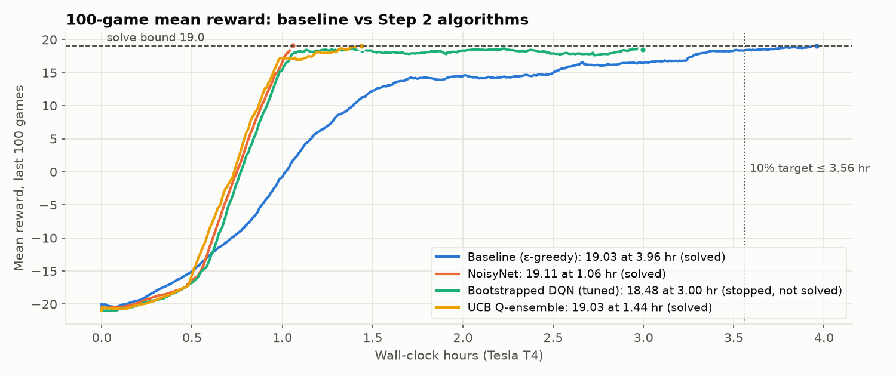

# CMPE 260 Project 1: DQN on Atari Pong

**Team:** Sankalp Wahane, Shreram Palanisamy

Starting from the DQN in *Deep Reinforcement Learning Hands-On*, Chapter 6 (replay buffer + target network + ε-greedy), we:
1. established a baseline on a Tesla T4,
2. replaced ε-greedy with **two other exploration algorithms** (NoisyNet and UCB Q-ensembles), and
3. added **Prioritized Experience Replay (PER)** to each.

Environment: `PongNoFrameskip-v4` (the book's default). All runs: Google Colab, **Tesla T4**.

## Results

**Convergence** = the 100-game mean reward first reaches ≥ 19.0. We report wall-clock time (measured with TensorBoard) and frames played. The assignment's "10% better than 10 minutes" is measured against **our own T4 baseline**: the book's 10-minute figure is not reproducible with this code (the author's own Chapter 7 logs show 87 minutes for basic DQN; see `results/RESULTS.md`).

| Step | Algorithm | Script | Frames to 19 | Time to 19 | Mean reward | vs baseline (time) |
|---|---|---|---|---|---|---|
| 1 | Baseline DQN, ε-greedy | `1_baseline_dqn.py` | 1,507,440 | 3.958 hr | 19.03 | — |
| 2a | **NoisyNet** | `2a_noisynet_dqn.py` | **385,176** | **1.057 hr** | **19.11** | **73.3% less (3.74× faster)** |
| 2b | **UCB Q-ensemble** | `2b_ucb_ensemble_dqn.py` | 568,001 | 1.438 hr | 19.03 | 63.7% less (2.75× faster) |
| 3a | NoisyNet + PER | `3a_noisynet_per_dqn.py` | 580,539 | 1.813 hr | 19.02 | 54.2% less |
| 3b | UCB + PER | `3b_ucb_per_dqn.py` | **542,750** | 1.517 hr | 19.01 | 61.7% less |
| (2x) | Bootstrapped DQN (tried for 2b) | `experiments/2x_bootstrapped_dqn.py` | not reached (best 18.64) | stopped at 3.01 hr | — | plateaued below 19 |

- **Step 2:** both algorithms beat the 10% target by a wide margin. Per-frame speed stayed about the same as the baseline (~100–110 frames/s), so **the gains come from better exploration (needing far fewer frames)**, not faster computation.
- **Step 3:** PER improved UCB in sample efficiency (**4.4% fewer frames**, mostly in the final 18 → 19 stretch) but not in wall-clock time (PER costs ~10% per frame). PER did **not** help NoisyNet in this setup (+51% frames). Our analysis points mainly to the book's small 10k replay buffer: uniform sampling already replays every transition ~32 times, which leaves little for prioritization to fix. Details in `results/NOISYNET.md` and `results/UCB.md`.
- Each result is a single run; run-to-run variance in Pong is large (see `results/RESULTS.md`).



## All training runs, in order

Every run was on Colab with a Tesla T4. "Frames" are agent steps, as counted by the book's code (each step = 4 game frames).

| # | Run | What we changed, and why | Outcome |
|---|---|---|---|
| 1 | **Baseline** (`1_baseline_dqn.py`) | The book's Chapter 6 DQN with **ε-greedy** exploration (ε 1.0 → 0.02 over 100k steps), replay buffer 10k, target sync every 1k steps, batch 32, training every step. Only ported to gymnasium; stop bound 19.0. | ✅ **19.03** in 1,507,440 frames, **3.958 hr** (~106 f/s) |
| 2 | **NoisyNet, run 1** (`2a_noisynet_dqn.py --no-random-warmup`) | Replaced ε-greedy with NoisyNet layers, to explore where the network is unsure instead of blindly. Nothing else changed. | ❌ **Stalled at -20.6** after 345k frames (0.95 hr): a fresh NoisyNet pressed almost one button, so the warm-up buffer held ~one action. Stopped. |
| 3 | **Bootstrapped DQN, run 1** (`experiments/2x_bootstrapped_dqn.py`) | Replaced ε-greedy with 10 heads; one random head plays each game. | ⚠️ Learning at the baseline's per-frame rate, but only **~60 f/s** (10 heads updated every step), projecting 6–7 hr. Stopped at 0.68 hr. |
| 4 | **Bootstrapped DQN, tuned** (`--heads 5 --train-every 2 --batch-size 64`) | **Tuned for speed:** 5 heads instead of 10, and one training step every 2 frames with batch 64 (same samples per frame, half the training steps). Back to ~110 f/s. | ⚠️ Reached 16.7 at 1.03 hr, best **18.64**, then **plateaued at 17.8–18.6**: weaker heads kept pulling the 100-game mean down. Stopped at 3.01 hr, not solved. |
| 5 | **NoisyNet, run 2** (`2a_noisynet_dqn.py --train-every 2 --batch-size 64`) | **Fix:** uniform random actions during the 10k-frame warm-up only (the original DQN's replay start), plus the same training tuning as run 4. | ✅ **19.11** in **385,176 frames, 1.057 hr**: **3.74× faster** than the baseline |
| 6 | **UCB Q-ensemble** (`2b_ucb_ensemble_dqn.py --heads 5 --train-every 2 --batch-size 64`) | **Fix for run 4's plateau:** same 5 heads, but every move uses all heads (mean + 0.1 × disagreement) instead of one random head per game. Same warm-up and tuning. | ✅ **19.03** in **568,001 frames, 1.438 hr**: **2.75× faster**, no plateau |
| 7 | **NoisyNet + PER** (`3a_noisynet_per_dqn.py --train-every 2 --batch-size 64`) | Step 3: run 5 + prioritized experience replay (α 0.6, β 0.4 → 1.0, sum tree). Nothing else changed. | ⚠️ **19.02** in 580,539 frames, 1.813 hr: slower than run 5 (+51% frames) |
| 8 | **UCB + PER** (`3b_ucb_per_dqn.py --heads 5 --train-every 2 --batch-size 64`) | Step 3: run 6 + the same PER. Nothing else changed. | ✅ **19.01** in **542,750 frames** (**4.4% fewer** than run 6), 1.517 hr (5.5% more time) |

Logs for every run are in `results/logs/`, and TensorBoard files in `results/tensorboard/`.

## Team contributions

| Part | Contributor |
|---|---|
| Repo setup; port of the Chapter 6 code to gymnasium / ale-py / NumPy 2.x (`lib/`, `1_baseline_dqn.py`, `play.py`) | Sankalp Wahane |
| Colab + TensorBoard setup; baseline training and documentation | Shreram Palanisamy |
| **Step 2a: NoisyNet** (`2a_noisynet_dqn.py`), including the stalled-run diagnosis and random warm-up fix | **Sankalp Wahane** |
| **Step 3a: NoisyNet + PER** (`3a_noisynet_per_dqn.py`) | **Sankalp Wahane** |
| **Step 2b: Bootstrapped DQN attempt → UCB Q-ensemble** (`experiments/2x_bootstrapped_dqn.py`, `2b_ucb_ensemble_dqn.py`) | **Shreram Palanisamy** |
| **Step 3b: UCB + PER** (`3b_ucb_per_dqn.py`) | **Shreram Palanisamy** |
| Comparison analysis, graphs, report, presentation | Both |

Code was developed with the assistance of an AI coding tool (Claude Code). Every design decision is documented, with its source, in `results/`.

## Repository layout

```
1_baseline_dqn.py          Step 1: book's DQN (gymnasium port), ε-greedy
2a_noisynet_dqn.py         Step 2a: NoisyNet exploration
2b_ucb_ensemble_dqn.py     Step 2b: UCB exploration over a 5-head Q-ensemble
3a_noisynet_per_dqn.py     Step 3a: NoisyNet + prioritized replay (sum tree)
3b_ucb_per_dqn.py          Step 3b: UCB Q-ensemble + prioritized replay
play.py                    watch / record a trained model (.dat)
lib/                       Atari wrappers + DQN network (book Chapter 6, ported)
experiments/               Bootstrapped DQN, tried for 2b, plateaued (kept for the report)
results/
  RESULTS.md               full lab notebook: every run, checkpoints, analysis
  NOISYNET.md, UCB.md      write-ups for Steps 2a/3a and 2b/3b
  logs/                    training logs (each ends with "Solved in N frames!")
  tensorboard/<run>/       TensorBoard event files
  plots/<run>/             TensorBoard screenshots and graphs; plots/comparison/
  videos/                  trained agents playing one game
colab/colab_commands.md    exact Colab cells used for every run
tools/plot_runs.py         redraws the graphs from results/tensorboard/
```

## How to run

```bash
git clone https://github.com/shreramsp/deep-rl-labs.git && cd deep-rl-labs/pong-dqn
pip install torch "gymnasium[atari]" ale-py opencv-python-headless tensorboardX
python 1_baseline_dqn.py --cuda
python 2a_noisynet_dqn.py      --cuda --train-every 2 --batch-size 64
python 2b_ucb_ensemble_dqn.py  --cuda --heads 5 --train-every 2 --batch-size 64
python 3a_noisynet_per_dqn.py  --cuda --train-every 2 --batch-size 64
python 3b_ucb_per_dqn.py       --cuda --heads 5 --train-every 2 --batch-size 64
tensorboard --logdir results/tensorboard      # view our recorded runs
python play.py -m <model>.dat                 # watch a trained model (models are not in git)
python tools/plot_runs.py                     # redraw the graphs from results/tensorboard/
```

Each training script stops on its own when the 100-game mean exceeds 19.0, saving the best model as a `.dat` file. Model files (7–65 MB) are excluded from git.

## References
1. Lapan, M. *Deep Reinforcement Learning Hands-On*, Chapters 6–7. Packt. Code: github.com/PacktPublishing/Deep-Reinforcement-Learning-Hands-On
2. Mnih et al. (2015). *Human-level control through deep reinforcement learning.* Nature.
3. Fortunato et al. (2018). *Noisy Networks for Exploration.* ICLR.
4. Chen, Sidor, Abbeel & Schulman (2017). *UCB Exploration via Q-Ensembles.* arXiv:1706.01502.
5. Osband, Blundell, Pritzel & Van Roy (2016). *Deep Exploration via Bootstrapped DQN.* NeurIPS.
6. Schaul, Quan, Antonoglou & Silver (2016). *Prioritized Experience Replay.* ICLR.
7. Sutton & Barto (2018). *Reinforcement Learning: An Introduction*, 2nd ed., §2.7 (UCB action selection).
8. Machado et al. (2018). *Revisiting the Arcade Learning Environment.* JAIR. (Pong-v4 vs v5 sticky actions.)
